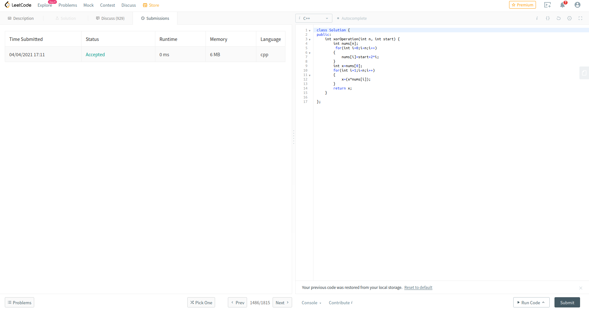
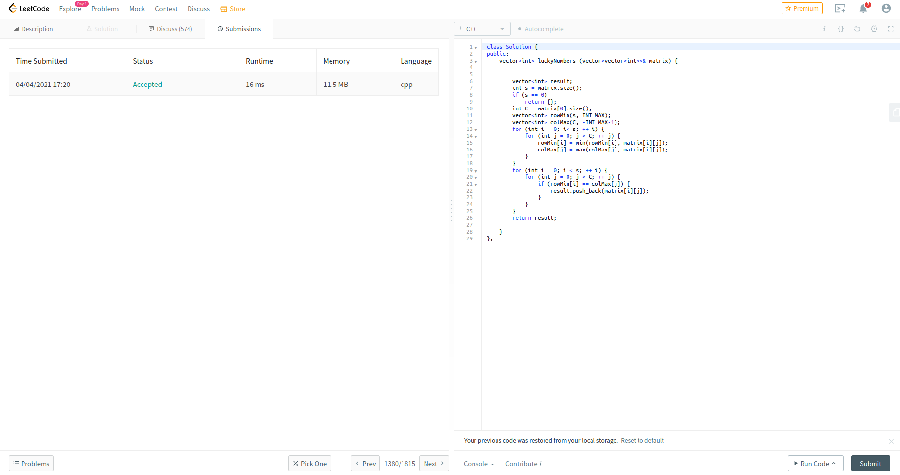
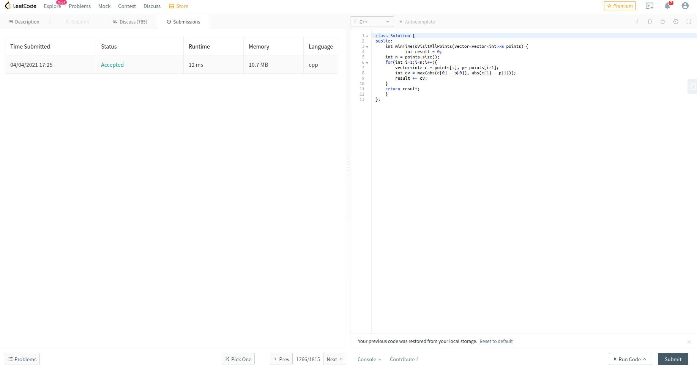
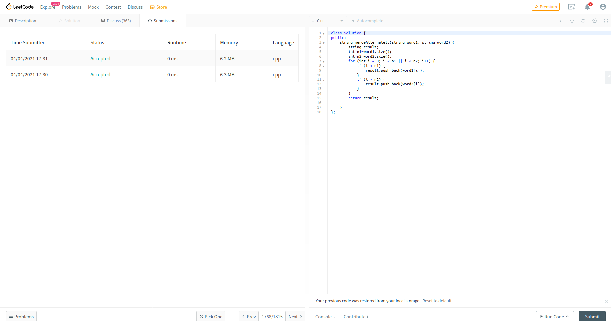
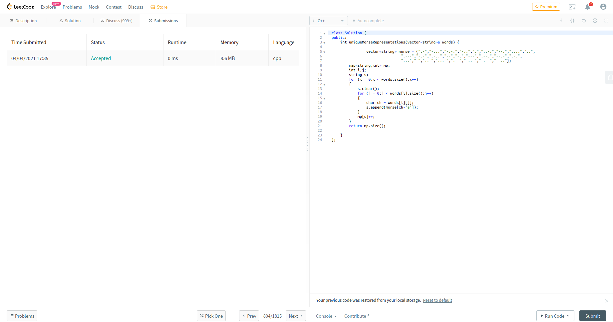

# Mandatory Task
All these questions on leetcode
#

* https://leetcode.com/problems/xor-operation-in-an-array/
### solution 1:

#

* https://leetcode.com/problems/lucky-numbers-in-a-matrix/
### solution 2:

#

* https://leetcode.com/problems/minimum-time-visiting-all-points/
### solution 3:

#

* https://leetcode.com/problems/merge-strings-alternately/
### solution 4:

#

* https://leetcode.com/problems/unique-morse-code-words/
### solution 5:

#
